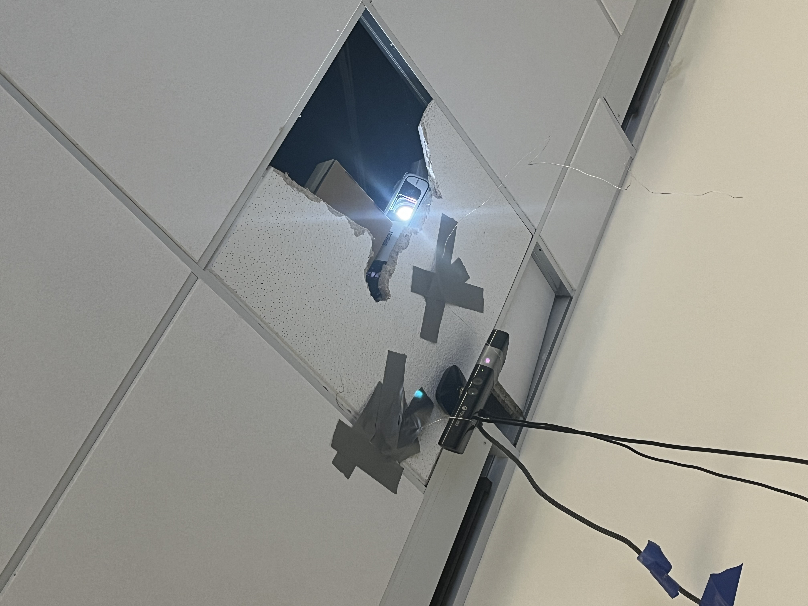

# CornCycle

[HARDWARE REPO LINK](https://github.com/USS-Watson/corncycle-hw)

<!-- In 2025, humanity faces more digital challenges than ever before, where the boundaries between the physical and virtual worlds are fading. Once a cutting-edge tool of fast-paced digital combat, lightcycle technology was thought to be lost to time. But from the ashes of a 43-year-old movie, this powerful technology has been resurrected.

The problem is clear: only the sharpest minds and the steadiest hands can master this new reality. The world is on the brink of destruction unless skilled pilots can harness the power of lightcycles and navigate this high-speed battlefield. The question is: can you rise to the challenge and ride the light, or will you be consumed by the very technology you attempt to control?

# Overview -->
CornCycle is a unique, real-life recreation of the iconic Tron Lightcycle game, brought to life for CornHacks 2025. CornCycle transforms a traditional digital game into a physical experience by combining computer vision, embedded systems, and interactive projection. Players control custom-built RC cars with game console remotes while avoiding digital light trails projected onto the table surface.

# Technologies Used
* Pygame – Graphics rendering and game mechanics

* OpenCV – Computer vision for tracking objects in real-time

* Xbox Kinect – Player tracking and environment awareness

* Custom Ceiling Tile Projector – Displays the game grid and light trails on the table

* RC Cars – Custom-built vehicles representing the lightcycles

* Game Console Remotes – Wiimotes and Xbox controllers for controlling the RC cars

* Elevenlabs – Custom AI voice clips for the in-game announcer

# Demo Video - WIP

# Infrared Player Tracking
In order for the game to locate cars in the battlefield in real-time, an infrared LED was placed on top of each car, visible from the Xbox Kinect. The Kinect was used with OpenCV and the [libfreenect](https://github.com/OpenKinect/libfreenect) library to detect these infrared LEDs and continuously track their locations over the course of the game.

# CornCycle Trails
The car location data was then fed into Pygame in order to draw the trails behind each player as the cars moved. When a car collides with a different color trail, that player loses and their trail disappears. Trails last forever, so inevitably players will run into another trail and eventually lose. If a player drives out of bounds of the projection area, they lose as well.

# Mapping to a Rectangle
Physical car locations needed to be converted in order to accurately represent the player locations inside Pygame. Practically, the four corners of the projection area were the four vertices of some arbitrary quad, and this quad needed to be transformed and mapped to the 800x600 rectangle inside Pygame. In order to do this, we placed LEDs at each of the four corners of the projection area and measured their locations to find the coordinate vertices of the quad. Then, we used a formula from linear algebra (found online) to write a function that maps any point in this quad to its corresponding point in the rectangle.

# The Ceiling Tile Projector
Our mounting solution to get projection on our surface was very unique to say the least. A trip to Home Depot the night before the hackathon before provided us our own ceiling tiles for custom modification. We ended up utilizing lots of duct tape to get our projector and Kinect 9 feet high. The building's existing ceiling tile was removed and placed elsewhere so we would not damage it. We did not damage anything we did not own and also ensured we returned the room to its state before our project.

# Our Team
1. [Alex Schwarz](https://curtain.sh) || [curtainman](https://github.com/curtainman)
2. [Anton Angeletti](https://antonangeletti.com) || [anton-3](https://github.com/anton-3)
3. [Blaine Traudt](https://traudt.dev) || [blaine-t](https://github.com/blaine-t)
4. [Louis Quattrocchi](https://waltlab.com) || [WalterOfNone](https://github.com/WalterOfNone)